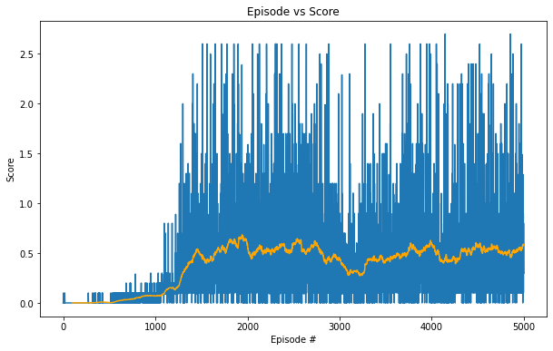

# Policy-Based Methods

## Implementation Description

### 1. Introduction
* **Objective**: The goal of each agent is to keep the ball in play.

### 2. Problem
* **State space**: The state space has `24` dimensions corresponding to position and velocity of the ball and racket. Each agent receives its own, local observation.

* **Action space**: Each action is a vector with `2` continuous numbers, corresponding to movement toward (or away from) the net, and jumping.

* **Reward Function**: A reward of `+0.1` is provided to an agent, if it hits the ball over the net. A reward of `-0.01` is provided to an agent, if it lets a ball hit the ground or hits the ball out of bounds.

### 3. DQN Agent Module
* **DQN Architecture**: Each DQN agent consists of two networks, the `actor` and the `critic`. There are target and local networks for both the actor and critic. 
    - `Actor Model`: The actor model consists of 2 hidden layers of size `512` and `256` respectively. The input is of size equals to the dimension of the state space which is `24`, the output is of size equals to the dimension of the action space which is `2`. The output is passed via a `tanh` function to squeeze the logits between `-1` and `1`.

    - `Critic Model`: The critic model also consists of 2 hidden layers of size `512` and `256` respectively. The input dimension is equals to the combined dimension of state space and action space, because the critic evaluates the `Q(s, a)`. It outputs a single value which is the Q value for the given state and action pair. 
    
    - **`NOTE`**: The state space input to the critic is equals to `n_agents` X `single agent observation dim`, because critic can see all the agent's state. But, the actor can only see its own agent's state alone.

* **Experience Replay**: The agent's interaction with the environments are stored in a list of tuple (`state, action, reward, next_state, done`) and these experiences are later retrieved and used for training.

* **Local and target networks**: Each Actor and Critic models consists of two different networks. The target network holds the weights for certain period of time whereas the local network uses the batch of experience to train on them. Then these weights are carried over to the target network. The target network is introducted to make the training stable and avoid *carrot and the horse* problem.

* **Training procedure**: The model uses a `Mean Squred Error` loss function and `Adam` optimizer for the training. 

### 4. MADDPG Module Training
* **Hyper-parameters**: The model uses several hyper parameters that plays a major role in the training. They are
    1. learning rate actor (`lr_actor`): 1e-4
    2. learning rate critic (`lr_critic`): 1e-3
    3. Dicount-factor (`gamma`): 0.99
    4. Batch size (`batch_size`): 256
    5. Soft update factor (`tau`): 5e-3
    6. Replay Buffer size (`buffer_size`): 1e6
    7. Updating frequency of target network (`update_every`): 1

* The agent trained for `5000` episodes and the maximum time-steps per episode is `2000`.

### 5. Result

* The agent reaches the average reward of `+0.5` over `100` consecutive episodes. The actual number of episodes required to solve the environment is `1700`.

### 6. Future Works
* `Collaborative Strategies`: Explore the advanced strategies for improving the cooperation among agents, such as joint policy learning, shared rewards and communication protocols.
* `Adversarial Agents`: Study how different agents can learn to operate in environments with adversarial agents or unknown opponents.
* `Transfer learning`: Generalization of learned behaviors across different tasks or environments.
* `Scalability`: As the number of agents increases, the states also increases if we consider the states of all the agents for training centrally. However, the de-centralized approach is another area where we can look into for scaling the MARL.
