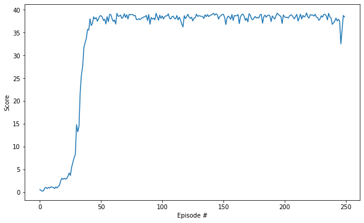

# Policy-Based Methods

## Implementation Description

### 1. Introduction
* **Objective**: The goal of the agent is to maintain its position at the target location for as many time steps as possible.

### 2. Problem
* **State space**: The state space is of dimension `33` corresponding to position, rotation, velocity, and angular velocities of the arm.

* **Action space**: Each action is a vector with `4` numbers, corresponding to torque applicable to two joints. Every entry in the action vector is between `-1` and `1`.

* **Reward Function**: A reward of `+0.1` is provided for each step that the agent's hand is in the goal location. Thus, the goal of the agent is to maintain its position at the target location for as many time steps are possible.

### 3. DQN Agent Module
* **DQN Architecture**: The DQN agent consists of two networks, the `actor` and the `critic`. There are target and local networks for both the actor and critic. 
    - `Actor Model`: The actor model consists of 2 hidden layers of size `512` and `256` respectively. The input is of size equals to the dimension of the state space which is `33`, the output is of size equals to the dimension of the action space which is `4`. The output is passed via a `tanh` function to squeeze the logits between `-1` and `1`.

    - `Critic Model`: The critic model consists of 3 hidden layers of size `512`, `256` and `128` respectively. The input dimension of the second hidden layer is added with the action dimension, because the critic evaluates the `Q(s, a)`. It outputs a single value which is the Q value for the given state and action pair. 

* **Experience Replay**: The agent's interaction with the environments are stored in a list of tuple (`state, action, reward, next_state, done`) and these experiences are later retrieved and used for training.

* **Local and target networks**: Each Actor and Critic models consists of two different networks. The target network holds the weights for certain period of time whereas the local network uses the batch of experience to train on them. Then these weights are carried over to the target network. The target network is introducted to make the training stable and avoid *carrot and the horse* problem.

* **Training procedure**: The model uses a `Mean Squred Error` loss function and `Adam` optimizer for the training. 

### 4. DDPG Module Training
* **Hyper-parameters**: The model uses several hyper parameters that plays a major role in the training. They are
    1. learning rate actor (`lr_actor`): 1e-4
    2. learning rate critic (`lr_critic`): 1e-3
    3. Dicount-factor (`gamma`): 0.99
    4. Batch size (`batch_size`): 256
    5. Soft update factor (`tau`): 1e-3
    6. Replay Buffer size (`buffer_size`): 1e5
    7. Updating frequency of target network (`update_every`): 20

* The agent trained for `250` episodes and the maximum time-steps per episode is `1000`.

### 5. Result

* The agent reaches the average reward of `+30` over `100` consecutive episodes. The actual number of episodes required to solve the environment is `111`.

### 6. Future Works
* Explore in the side of hyper-parameter tuning using `Bayesian Optimization`.
* Implementing a `Curiosity-driven Exploration` methods which motivates by rewarding the agent to explore unfamiliar states.
