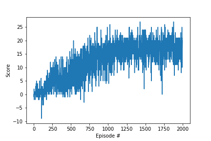

# Value-Based Methods

A Smart Agent in action

## Implementation Description

### 1. Introduction
* **Objective**: The goal of the agent is to collect as many yellow banana as possible while avoiding blue bananas.

### 2. Problem
* **State space**: The state space is of dimension `37` consisting of velocity, ray based perception of objects.
* **Action space**: There are `4` discrete actions the agent can take. They are `forward`, `backward`, `left` and `right`.
* **Reward Function**: A reward of `+1` is given to the agent if it collects a yellow banana, and a reward of `-1` is provided for collecting a blue banana.

### 3. DQN Module
* **DQN Architecture**: The DQ-Network consists of 3 hidden layers of sizes `128`, `64` and `32` respectively. The input is of size equals to the dimension of the state space which is `32` and the output is of size equals to the dimension of the action space which is `4`. The architecture consists of `ReLU` activation functions and also uses `batch normalization` to normalize the hidden layer weights. Introduced a `drop out` of `0.1` percent to prevent the model from overfitting. 

* **Experience Replay**: The agent's interaction with the environments are stored in a list of tuple (`state, action, reward, next_state, done`) and these experiences are later retrieved and used for training.

* **Local and target networks**: The model consists of two different networks. The target network holds the weights for certain period of time whereas the local network uses the batch of experience to train on them. Then these weights are carried over to the target network. The target network is introducted to make the training stable and avoid *carrot and the horse* problem.

* **Training procedure**: The model uses a `Mean Squred Error` loss function and `Adam` optimizer for the training. 

* **Policy**: Used `epsilon-greedy` policy. The value of epsilon decays as the episode increases. The starting value of epsilon is `1.0` and the ending value is `0.001`. The epsilon decays with a rate of `0.995`.

### 4. Training
* **Hyper-parameters**: The model uses several hyper parameters that plays a major role in the training. They are
    1. learning rate (`lr`): 5e-4
    2. Dicount-factor (`gamma`): 0.99
    3. Batch size (`batch_size`): 64
    4. Soft update factor (`tau`): 1e-3
    5. Replay Buffer size (`buffer_size`): 1e7
    6. Updating frequency of local network (`local_update_freq`): 4
    7. Updating frequency of target network (`target_update_freq`): 20

* The agent trained for `2000` episodes and the maximum time-steps per episode is `1000`.

### 5. Result

* The agent reaches the average reward of `+13` over `100` consecutive episodes. The actual number of episodes required to solve the environment is in between `850` and `900`. 

### 6. Future Works
* Explore in the side of hyper-parameter tuning using `Bayesian Optimization`.
* Implementing a `Curiosity-driven Exploration` methods which motivates by rewarding the agent to explore unfamiliar states.
